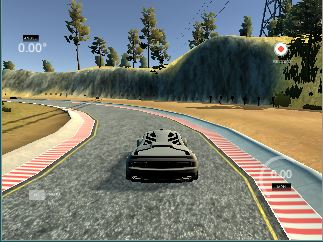

# Udacity Self Driving Car Behavioral Cloning Project

This project involves using an AI program to mimic human driving behavior.  A driving simulator software program is used to record the behavior of a human driving a car.  The data captured is images from cameras mounted on the car as well as throttle, brake, steering angle, and speed.   This data is then used to train a neural network to drive the car as well as a human.
 
 

 

 

<b>A typical view of the track when operating simulator.</b>

 

  

## Deliverable Files

File | Description
------------ | -------------
<a href="https://github.com/TheOnceAndFutureSmalltalker/street_sign_recognition/blob/master/model.py">model.py</a> | Python code defining the neural network used to train the model from input images and throttle angles
model.h5 | The model developed by the neural network that mimics human driving of the simulated car
<a href="https://github.com/TheOnceAndFutureSmalltalker/behavioral_cloning/blob/master/drive.py">drive.py</a> | Python code used to load and run the model in the car simulator
<a href="https://github.com/TheOnceAndFutureSmalltalker/street_sign_recognition/blob/master/writeup.md">writeup_report.md</a> | Full description of the project and suggestions for improvement
img | Folder of various images used for illustration purposes
<a href="https://github.com/TheOnceAndFutureSmalltalker/behavioral_cloning/blob/master/video.mp4">video.mp4</a> | Video of AI program driving the car around the track

## Instructions

Currently, this repository does not contain all required dependencies, support files, and instructions for actually running the simulation.  This to come later.  

