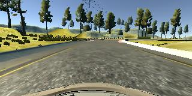
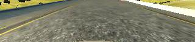
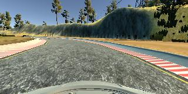
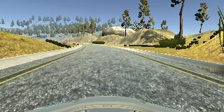
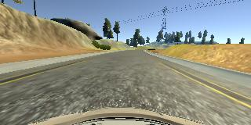
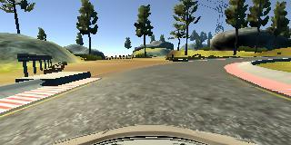

# Behavioral Cloning Project

The goals / steps of this project are the following:
* Use the simulator to collect data of good driving behavior
* Build a convolution neural network in Keras that predicts steering angles from images
* Train and validate the model with a training and validation set
* Test that the model successfully drives around track one without leaving the road
* Summarize the results with a written report
<br />
<p align="center"> </p>
<p align="center"><b>A typical view of the track when operating simulator.</b></p>
<br />

## Rubric Points

Here I will consider the [rubric points](https://review.udacity.com/#!/rubrics/432/view) individually and describe how I addressed each point in my implementation.  

---
### Files Submitted & Code Quality

#### 1. My project includes the following files:

File | Description
------------ | -------------
<a href="https://github.com/TheOnceAndFutureSmalltalker/street_sign_recognition/blob/master/model.py">model.py</a> | Python code defining the neural network used to train the model from input images and throttle angles
model.h5 | The model developed by the neural network that mimics human driving of the simulated car
<a href="https://github.com/TheOnceAndFutureSmalltalker/behavioral_cloning/blob/master/drive.py">drive.py</a> | Python code used to load and run the model in the car simulator
<a href="https://github.com/TheOnceAndFutureSmalltalker/street_sign_recognition/blob/master/writeup.md">writeup_report.md</a> | Full description of the project and suggestions for improvement
<a href="https://github.com/TheOnceAndFutureSmalltalker/behavioral_cloning/blob/master/video.mp4">video.mp4</a> | Video of AI program driving the car around the track

#### 2. Code Function and Execution
1. Driving data is first acquired by executing the simulator in <e>record mode</e> and saving images and a log file of numeric data to a folder.
```sh
windows_sim.exe
```

2. The images and log file are then read in by model.py which then uses the input data to train a convolutional neural network to drive the simulator and saves the model to the file model.h5.
```sh
python model.py
```

3. The drive.py file is then used to test the trained model, again using the simulator, by providing the model's suggested steering angle given the current road image of the simulator. 
```sh
python drive.py model.h5
```

4. If the model performs well, a video of its driving can be captured in a folder using video.py.
```sh
python drive.py model.h5 <folder>
```

#### 3. Submission Code Readability and Usability

The model.py file contains the Python/Keras code for training and saving the convolution neural network. It loads the images and steering angles from the simulation output.  It does any image manipulation necessary.  It defines the neural network architecture.  It defines the cost function and optimization function.  It defines any hyper parameters required for training.  It then trains and saves the model to a file.

The drive.py was originally provided by Udacity.  It uses socketio to receive an image from simulator, run it through the trained model, and return back an appropriate steering angle to the simulator.  I added one line of code for converting the received image from simulator from RGB to BGR since the model was trained on BGR images.


### Model Architecture and Training Strategy

#### 1. An appropriate model architecture has been employed

I initially tried an AlexNet architecture but did not get adequate results.  I then switched to the NVIDIA architecture which was developed specifically for self driving cars.  I tweaked this a bit resulting in the following 8 layer architecture. 

Layer | Description
------------ | -------------
Layer 1 | Input layer of image dimension 160 X 300 X 3, normalized, then cropped to output dimension 70 X 320 X 3
Layer 2 | 5 X 5 convolutional layer with 2 X 2 pooling, relu activation, resulting in output dimension 33 X 158 X 24 
Layer 3 | 5 X 5 convolutional layer with 2 X 2 pooling, relu activation resulting in output dimension 15 X 77 X 36
Layer 4 | 5 X 5 convolutional layer with 2 X 2 pooling, relu activation resulting in output dimension 6 X 37 X 48
Layer 5 | 3 X 3 convolutional layer, relu activation resulting in output dimension 4 X 37 X 64
Layer 6 | 3 X 3 convolutional layer, relu activation resulting in output dimension 2 X 37 X 64
Layer 7 | Flatten to output dimension 4736
Layer 8 | Fully connected layer with output dimension 100 with Dropout rate of 0.5
Layer 9 | Fully connected layer with output dimension 50 with dropout rate of 0.5
Layer 10 | Final output of dimension 1


#### 2. Attempts to reduce overfitting in the model

To prevent overfitting I used the following strategies.  

1. Stop training once the training and validation losses stopped reducing.  This happened very quickly for this architecture.  Just 2 or 3 epochs was usually enough.  Especially for larger data sets which run several more mini batches.  

2. Increased the data set making it less likely the model will overfit.

3. Employed dropout on the last 2 fully connected layers (model.py lines 50 & 52)

The model was tested by running it through the simulator and ensuring that the vehicle could stay on the track.

#### 3. Model parameter tuning

The model used an adam optimizer, so the learning rate was not tuned manually (model.py line 57).

The number of epochs was eventually tuned to 3 (model.py line 60).  I tried 1, 2 and as high as 20.  The lowest errors seemed to occur by epoch 3 without having any benefit to training further.

The dropout rate was 0.5 and not tuned at all.

I ended up using a training/validation split of 0.9/0.1 because the data set I eventually used had over 8,000 images and I felt 10% of that was fine for validation giving me more images to train on.

The raw images were cropped to eliminate those parts of the image better focus the training on those parts of the image that actually contain the road.  For this purpose, the images were cropped 70 pixels from top and 20 pixels from bottom resulting in mage dimension of 90 X 320 X 3.  Nothing was cropped from the sides.

#### 4. Appropriate training data

After several failed attempts at generating my own training data, I ended up using the training data supplied by Udacity.  It was much higher quality and more data than I could provide.  

For details of my own experiences capturing data, see the section below.

### Model Architecture and Training Strategy

#### 1. Solution Design Approach

For my model architecture, I initially tried an AlexNet architecture since this is a successful architecture for image classification and one with which I am familiar.  This did not perform well however.  The test scenario on the simulator did not perform. Perhaps because this was a numerical regression instead of a logistical regression for purposes of classification which is what the AlexNet is used for.  

I then switched to the NVIDIA architecture which was developed specifically for self driving cars.  I tweaked this a bit resulting in the following 8 layer architecture (recreated from previous section). 

As mentioned earlier, to improve training, I cropped 70 pixels from top of image and 20 pixels from bottom of image in order to remove any information not directly involved in steering.  That is, any parts of image not showing the road.  

<p align="center"> </p>
<p align="center"><b>Original Image.</b></p>

<p align="center"> </p>
<p align="center"><b>Cropped Image.</b></p>

To help prevent overfitting, I added dropout after each of the last fully connected layers.

The ability to train the model was most influenced by the quality and amount of traiing data.  I would go through iterations of capturing data, training, and then testing the model.  This was a long laborious process!  

Once I finally downloaded the sample data from Udacity, the entire process went much smoother because I then had data in which I could be confident and could concentrate on tuning the model.


#### 2. Final Model Architecture

The final model architecture (model.py lines 40-53) consisted of a convolution neural network with the following layers and dimensions (recreated from above).

Layer | Description
------------ | -------------
Layer 1 | Input layer of image dimension 160 X 300 X 3, normalized, then cropped to output dimension 70 X 320 X 3
Layer 2 | 5 X 5 convolutional layer with 2 X 2 pooling, relu activation, resulting in output dimension 33 X 158 X 24 
Layer 3 | 5 X 5 convolutional layer with 2 X 2 pooling, relu activation resulting in output dimension 15 X 77 X 36
Layer 4 | 5 X 5 convolutional layer with 2 X 2 pooling, relu activation resulting in output dimension 6 X 37 X 48
Layer 5 | 3 X 3 convolutional layer, relu activation resulting in output dimension 4 X 37 X 64
Layer 6 | 3 X 3 convolutional layer, relu activation resulting in output dimension 2 X 37 X 64
Layer 7 | Flatten to output dimension 4736
Layer 8 | Fully connected layer with output dimension 100 with Dropout rate of 0.5
Layer 9 | Fully connected layer with output dimension 50 with dropout rate of 0.5
Layer 10 | Final output of dimension 1

### 3. Creation of the Training Set & Training Process

**Explanation of Image Data** The images that are captured from the simulator do not look like the images when running the simulator.  

<br />
<p align="center"> </p>
<p align="center"><b>A typical view of the track from simulator perspective.</b></p>
<br />

Instead, the captured images appear as they would from perspective of a camera mounted on the vehicle.

<br />
<p align="center"> </p>
<p align="center"><b>A typical view of the track from car perspective.</b></p>
<br />

**Center Lane Driving** I tried several approaches to capturing my own data. Initially I did just simple, center lane driving for a single lap.  I was not very good at this.  I tried using both mouse and keyboard.  I had more success with mouse but still took a while to complete one decent lap.  

<p align="center"> </p>
<p align="center"><b>Center lane driving.</b></p>

**Slow Driving**  In order to keep the car better centered, I tried going slow.  Previously I had gone full throttle but found it hard to control on the curves.  But when this slower throttle data was trained, it yielded terrible results.  I suspect because steering angle is affected by speed.

**Reverse Track Driving**  To enhance the data set, I drove the track in the opposite direction (clockwise).  The normal driving is mostly left hand turns (one exception).  In the image below, clockwise driving, the road is veering to the right, and not left.  This should help the model to generalize.  The trained models with this enhanced dataset, did not improve much.

<p align="center"> </p>
<p align="center"><b>Image of driving the track the other way.</b></p>

**Flipped Images**  In order to enhance data set without having to operate the simulator, I tried flipping the images that I captured.  This doubled the data set and is similar to driving the track in the opposite direction.

<p align="center"> </p>
<p align="center"><b>Original Image.</b></p>

<p align="center"> </p>
<p align="center"><b>Flipped Image.</b></p>

**Other Techniques** Some of the other techniques I tried were to capture case of recovering from being on one side of the road or the other.  This was difficult for me to accomplish.  I also created a data set of 2 laps.  Neither of these seemed to help generate a successful model.

**Model Training** In training the model, I spent way too much time training on my poor quality data which, of course, did not yield models which could drive the track successfully.  Initially, I never knew if it was my network architecture or the data that was at fault.  I slowly began to suspect that the data was just not good enough. My simulator driving is bad!  Therefor, I was training my model how to drive poorly!

Finally, after much frustration, I ended up using Udacity's data set which is much richer and higher quality than what I was able to produce myself.  After inspecting it, I noticed it included a lap (perhaps more) of driving the track in the opposite direction, so I removed my image flipping code form model.py.

Staying with the NVIDIA architecture I trained a new model with the Udacity supplied data.  I only used the center camera images.  I trained several models with this same architecture and data.  I was able to produce a model that went around the track quite nicely except for some problems at the right turn after bridge.  The car would swing wide and sometimes hit the berm and sometimes just came close.

I submitted this model and video but it was rejected since the car came too close to the berm.  The reviewer made several suggestions.  One of which was converting simulator images from RGB to BGR since openCV used in the training of the model reads in images as BGR (I had no idea this waas the case!).  After I added this one-line change to drive.py, the original model performed great, avoiding the outside berm on the right hand turn and staying in center of track throughout.  


